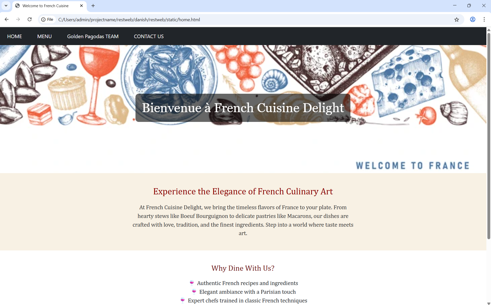
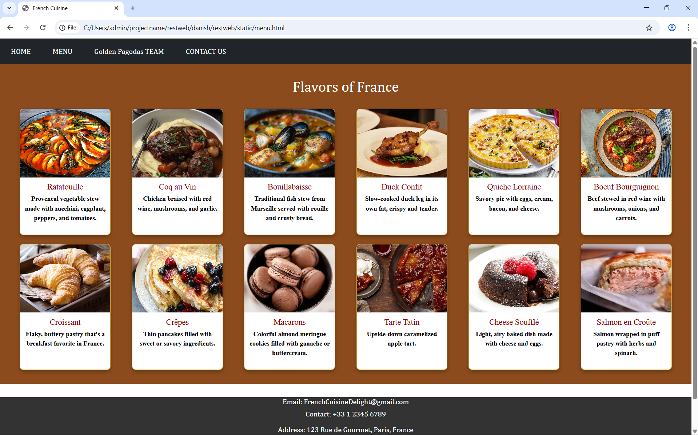
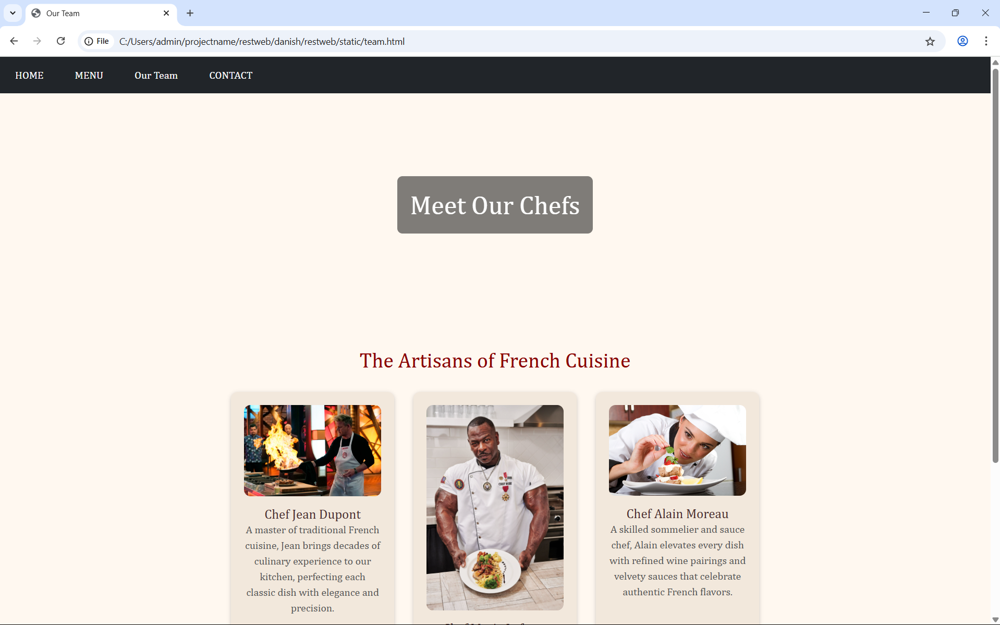

# Ex.07 Restuarant Website
## Date:17/11/25

## AIM:
To develop a static Resturant website to display the menu and services provided by the resturant.

## DESIGN STEPS:

### Step 1:
Requirement collection.

### Step 2:
Creating the layout using HTML and CSS.

### Step 3:
Updating the sample content.

### Step 4:
Choose the appropriate style and color scheme.

### Step 5:
Validate the layout in various browsers.

### Step 6:
Validate the HTML code.

### Step 7:
Publish the website in the given URL.

## PROGRAM:
```
home.html
<!DOCTYPE html>
<html>
<head>
  <link href="design.css" rel="stylesheet">
  <link href="https://cdn.jsdelivr.net/npm/bootstrap@5.3.3/dist/css/bootstrap.min.css" rel="stylesheet">
  <script src="https://cdn.jsdelivr.net/npm/bootstrap@5.3.3/dist/js/bootstrap.bundle.min.js"></script>

  <title>Welcome to French Cuisine</title>
  <style>
    .banner {
      background-image: url('BG PIC.webp'); /* Replace with a relevant image file */
      background-size: cover;
      background-position: center;
      height: 400px;
      text-align: center;
      color: white;
      display: flex;
      align-items: center;
      justify-content: center;
      font-family: 'Georgia', serif;
    }

    .banner h1 {
      background-color: rgba(0, 0, 0, 0.6);
      padding: 20px;
      border-radius: 10px;
      font-size: 40px;
    }

    .intro {
      text-align: center;
      padding: 40px;
      background-color: #f8f1e4;
      font-family: 'Cambria', serif;
    }

    .intro h2 {
      font-size: 28px;
      margin-bottom: 20px;
      color: #8B0000;
    }

    .intro p {
      font-size: 18px;
      color: #333;
      max-width: 700px;
      margin: auto;
    }

    .highlight-section {
      background-color: #fff;
      padding: 40px;
      text-align: center;
      font-family: 'Cambria', serif;
    }

    .highlight-section h3 {
      font-size: 24px;
      color: #6e1a1a;
      margin-bottom: 20px;
    }

    .highlight-section ul {
      list-style: none;
      padding: 0;
      font-size: 18px;
    }

    .highlight-section ul li::before {
      content: "🍷 ";
    }
  </style>
</head>
<body>
  <div class="navi">
    <nav class="navbar navbar-expand-sm bg-dark">
      <ul class="navbar-nav">
        <li class="nav-item bg-dark mx-3">
          <a class="nav-link text-white" href="home.html">HOME</a>
        </li>
        <li class="nav-item bg-dark mx-3">
          <a class="nav-link text-white" href="menu.html">MENU</a>
        </li>
        <li class="nav-item bg-dark mx-3">
          <a class="nav-link text-white" href="team.html">Golden Pagodas TEAM</a>
        </li>
        <li class="nav-item bg-dark mx-3">
          <a class="nav-link text-white" href="contact.html">CONTACT US</a>
        </li>
      </ul>
    </nav>
  </div>

  <div class="banner">
    <h1>Bienvenue à French Cuisine Delight</h1>
  </div>

  <div class="intro">
    <h2>Experience the Elegance of French Culinary Art</h2>
    <p>
      At French Cuisine Delight, we bring the timeless flavors of France to your plate. From hearty stews like Boeuf Bourguignon to delicate pastries like Macarons, our dishes are crafted with love, tradition, and the finest ingredients. Step into a world where taste meets art.
    </p>
  </div>

  <div class="highlight-section">
    <h3>Why Dine With Us?</h3>
    <ul>
      <li>Authentic French recipes and ingredients</li>
      <li>Elegant ambiance with a Parisian touch</li>
      <li>Expert chefs trained in classic French techniques</li>
      <li>Exquisite wine pairings</li>
      <li>Delightful desserts to sweeten every moment</li>
    </ul>
  </div>

  <footer style="background-color:#333;height:150px;width:100%;color:white;text-align:center;font-family:Cambria, serif;font-size:5px;">
    <h2 style="font-size:medium; margin-top:4px;">Email: FrenchCuisineDelight@gmail.com</h2>
    <h2 style="font-size:medium;">Contact: +33 1 2345 6789</h2>
    <br>
    <h2 style="font-size:medium;">Address: 123 Rue de Gourmet, Paris, France</h2>
    <br>
    <h2 style="font-size:medium;">---------- Where Every Dish Tells A French Tale ----------</h2>
  </footer>
</body>
</html>
```
```
menu.html
<html>
<head>
    <link href="design.css" rel="stylesheet">
    <link href="https://cdn.jsdelivr.net/npm/bootstrap@5.3.3/dist/css/bootstrap.min.css" rel="stylesheet">        
    <script src="https://cdn.jsdelivr.net/npm/bootstrap@5.3.3/dist/js/bootstrap.bundle.min.js"></script>
  
  <title>French Cuisine</title>
  <style>
    .navi {
        font-family: Cambria, Cochin, Georgia, Times, 'Times New Roman', serif;
    }
    
    .menu-section {
      background-color: #8c4b1c;
      padding: 30px;
      color: #fff;
      text-align: center;
      font-family: 'Times New Roman', Times, serif;
      font-weight: bold;
    }

    .menu-title {
      color: white;
      font-size: 32px;
      margin-bottom: 30px;
      font-family: Cambria, Cochin, Georgia, Times, 'Times New Roman', serif;
    }

    .menu-grid {
      display: grid;
      grid-template-columns: repeat(auto-fit, minmax(200px, 1fr));
      gap: 20px;
      justify-items: center;
    }

    .menu-card {
      background-color: white;
      color: black;
      border-radius: 8px;
      overflow: hidden;
      width: 200px;
      box-shadow: 0 4px 8px rgba(0,0,0,0.3);
      text-align: center;
      border: 1px solid #D4AF37;
    }

    .menu-card img {
      width: 100%;
      height: 150px;
      object-fit: cover;
    }

    .menu-card h3 {
      font-size: 18px;
      margin: 10px 0 5px;
      color: #8B0000;
    }

    .menu-card p {
      font-size: 14px;
      padding: 0 10px 10px;
    }
  </style>
</head>
<body>
  <div class="navi">
    <nav class="navbar navbar-expand-sm bg-dark">
      <ul class="navbar-nav">
        <li class="nav-item bg-dark mx-3">
          <a class="nav-link text-white" href="home.html">HOME</a>
        </li>
        <li class="nav-item bg-dark mx-3">
          <a class="nav-link text-white" href="menu.html">MENU</a>
        </li>
        <li class="nav-item bg-dark mx-3">
          <a class="nav-link text-white" href="team.html">Golden Pagodas TEAM</a>
        </li>
        <li class="nav-item bg-dark mx-3">
          <a class="nav-link text-white" href="contact.html">CONTACT US</a>
        </li>
      </ul>
    </nav>
  </div>
    
  <div class="menu-section">
    <h2 class="menu-title">Flavors of France</h2>
    <div class="menu-grid">
      <div class="menu-card">
        
        <h3>Ratatouille</h3>
        <p>Provencal vegetable stew made with zucchini, eggplant, peppers, and tomatoes.</p>
      </div>
      <div class="menu-card">
        
        <h3>Coq au Vin</h3>
        <p>Chicken braised with red wine, mushrooms, and garlic.</p>
      </div>
      <div class="menu-card">
        
        <h3>Bouillabaisse</h3>
        <p>Traditional fish stew from Marseille served with rouille and crusty bread.</p>
      </div>
      <div class="menu-card">
        
        <h3>Duck Confit</h3>
        <p>Slow-cooked duck leg in its own fat, crispy and tender.</p>
      </div>
      <div class="menu-card">
        
        <h3>Quiche Lorraine</h3>
        <p>Savory pie with eggs, cream, bacon, and cheese.</p>
      </div>
      <div class="menu-card">
        
        <h3>Boeuf Bourguignon</h3>
        <p>Beef stewed in red wine with mushrooms, onions, and carrots.</p>
      </div>
      <div class="menu-card">
        
        <h3>Croissant</h3>
        <p>Flaky, buttery pastry that's a breakfast favorite in France.</p>
      </div>
      <div class="menu-card">
        
        <h3>Crêpes</h3>
        <p>Thin pancakes filled with sweet or savory ingredients.</p>
      </div>
      <div class="menu-card">
        
        <h3>Macarons</h3>
        <p>Colorful almond meringue cookies filled with ganache or buttercream.</p>
      </div>
      <div class="menu-card">
        
        <h3>Tarte Tatin</h3>
        <p>Upside-down caramelized apple tart.</p>
      </div>
      <div class="menu-card">
        
        <h3>Cheese Soufflé</h3>
        <p>Light, airy baked dish made with cheese and eggs.</p>
      </div>
      <div class="menu-card">
        
        <h3>Salmon en Croûte</h3>
        <p>Salmon wrapped in puff pastry with herbs and spinach.</p>
      </div>
    </div>
  </div>
</body>

<footer style="background-color:#333;height:150px;width:100%;color:white;text-align:center;font-family:Cambria, Cochin, Georgia, Times, 'Times New Roman', serif;font-size:5px;margin-top:30px;">
  <h2 style="font-size:medium; margin-top:4px;">Email: FrenchCuisineDelight@gmail.com</h2>
  <h2 style="font-size:medium;">Contact: +33 1 2345 6789</h2>
  <br>
  <h2 style="font-size:medium;">Address: 123 Rue de Gourmet, Paris, France</h2>
  <br>
  <h2 style="font-size:medium;">---------- Where Every Dish Tells A French Tale ----------</h2>
</footer>

</html>
```
```
team.html
<!DOCTYPE html>
<html>
<head>
  <link href="design.css" rel="stylesheet">
  <link href="https://cdn.jsdelivr.net/npm/bootstrap@5.3.3/dist/css/bootstrap.min.css" rel="stylesheet">
  <script src="https://cdn.jsdelivr.net/npm/bootstrap@5.3.3/dist/js/bootstrap.bundle.min.js"></script>
  <title>Our Team</title>
  <style>
    body {
      font-family: 'Cambria', serif;
      background-color: #fff8f0;
    }

    .banner {
      background-image: url('french_team_banner.jpg'); /* Replace with actual image */
      background-size: cover;
      background-position: center;
      height: 350px;
      display: flex;
      align-items: center;
      justify-content: center;
      color: white;
    }

    .banner h1 {
      background-color: rgba(0, 0, 0, 0.5);
      padding: 20px;
      border-radius: 8px;
    }

    .team-section {
      text-align: center;
      padding: 40px;
    }

    .team-section h2 {
      color: #8B0000;
      margin-bottom: 30px;
    }

    .team-grid {
      display: flex;
      justify-content: center;
      gap: 30px;
      flex-wrap: wrap;
    }

    .team-member {
      background-color: #f2e8dc;
      border-radius: 10px;
      padding: 20px;
      width: 250px;
      box-shadow: 0 2px 6px rgba(0, 0, 0, 0.2);
    }

    .team-member img {
      width: 100%;
      border-radius: 10px;
      margin-bottom: 15px;
    }

    .team-member h4 {
      margin: 0;
      font-size: 20px;
      color: #4b2e2e;
    }

    .team-member p {
      font-size: 16px;
      color: #555;
    }
  </style>
</head>
<body>

  <nav class="navbar navbar-expand-sm bg-dark">
    <ul class="navbar-nav">
      <li class="nav-item mx-3"><a class="nav-link text-white" href="home.html">HOME</a></li>
      <li class="nav-item mx-3"><a class="nav-link text-white" href="menu.html">MENU</a></li>
      <li class="nav-item mx-3"><a class="nav-link text-white" href="team.html">Our Team</a></li>
      <li class="nav-item mx-3"><a class="nav-link text-white" href="contact.html">CONTACT</a></li>
    </ul>
  </nav>

  <div class="banner">
    <h1>Meet Our Chefs</h1>
  </div>

  <div class="team-section">
    <h2>The Artisans of French Cuisine</h2>
    <div class="team-grid">
      <div class="team-member">
        
        <h4>Chef Jean Dupont</h4>
        <p>A master of traditional French cuisine, Jean brings decades of culinary experience to our kitchen, perfecting each classic dish with elegance and precision.</p>
      </div>
      <div class="team-member">
        
        <h4>Chef Marie Lefevre</h4>
        <p>Our pastry expert, Marie crafts exquisite desserts—from flaky croissants to rich éclairs—infusing each bite with her passion for French patisserie.</p>
      </div>
      <div class="team-member">
        
        <h4>Chef Alain Moreau</h4>
        <p>A skilled sommelier and sauce chef, Alain elevates every dish with refined wine pairings and velvety sauces that celebrate authentic French flavors.</p>
      </div>
    </div>
  </div>

  <footer style="background-color:#333;color:white;text-align:center;padding:20px;">
    <p>Email: FrenchCuisineDelight@gmail.com | Contact: +33 1 2345 6789</p>
    <p>Address: 123 Rue de Gourmet, Paris, France</p>
  </footer>
</body>
</html>
```
```
contact.html
<!DOCTYPE html>

<html>

<head>

  <link href="design.css" rel="stylesheet">

  <link href="https://cdn.jsdelivr.net/npm/bootstrap@5.3.3/dist/css/bootstrap.min.css" rel="stylesheet">

  <script src="https://cdn.jsdelivr.net/npm/bootstrap@5.3.3/dist/js/bootstrap.bundle.min.js"></script>

  <title>Contact Us</title>

  <style>

    body {

      font-family: 'Georgia', serif;

      background-color: #fff8f0;

    }


    .banner {

      background-image: url('French_contact_banner.jpg'); /* Replace with an appropriate French-themed image */

      background-size: cover;

      background-position: center;

      height: 350px;

      display: flex;

      align-items: center;

      justify-content: center;

      color: white;

    }


    .banner h1 {

      background-color: rgba(0, 0, 0, 0.5);

      padding: 20px;

      border-radius: 8px;

    }


    .contact-form {

      padding: 40px;

      max-width: 700px;

      margin: auto;

      background-color: #f9f1e7;

      border-radius: 10px;

      box-shadow: 0 2px 8px rgba(0, 0, 0, 0.1);

    }


    .contact-form h2 {

      text-align: center;

      margin-bottom: 30px;

      color: #8B0000;

    }


    .form-control {

      margin-bottom: 20px;

    }


    footer {

      background-color: #333;

      color: white;

      text-align: center;

      padding: 20px;

      margin-top: 50px;

    }

  </style>

</head>

<body>


  <nav class="navbar navbar-expand-sm bg-dark">

    <ul class="navbar-nav">

      <li class="nav-item mx-3"><a class="nav-link text-white" href="home.html">HOME</a></li>

      <li class="nav-item mx-3"><a class="nav-link text-white" href="menu.html">MENU</a></li>

      <li class="nav-item mx-3"><a class="nav-link text-white" href="team.html">OUR TEAM</a></li>

      <li class="nav-item mx-3"><a class="nav-link text-white" href="contact.html">CONTACT</a></li>

    </ul>

  </nav>


  <div class="banner">

    <h1>Contact French Cuisine Delight</h1>

  </div>


  <div class="contact-form">

    <h2>We'd Love to Hear From You</h2>

    <form>

      <div class="form-group">

        <label for="name">Your Name:</label>

        <input type="text" class="form-control" id="name" placeholder="Enter your full name">

      </div>


      <div class="form-group">

        <label for="email">Email Address:</label>

        <input type="email" class="form-control" id="email" placeholder="example@domain.com">

      </div>


      <div class="form-group">

        <label for="subject">Subject:</label>

        <input type="text" class="form-control" id="subject" placeholder="Your message subject">

      </div>


      <div class="form-group">

        <label for="message">Message:</label>

        <textarea class="form-control" id="message" rows="5" placeholder="Write your message here..."></textarea>

      </div>


      <button type="submit" class="btn btn-dark w-100">Send Message</button>

    </form>

  </div>


  <footer>

    <p>Email: FrenchCuisineDelight@gmail.com | Phone: +33 1 2345 6789</p>

    <p>Address: 123 Rue de Gourmet, Paris, France</p>

    <p>&copy; 2025 French Cuisine Delight. All rights reserved.</p>

  </footer>


</body>

</html>
```

## OUTPUT:




## RESULT:
The program for designing software company website using HTML and CSS is completed successfully.
